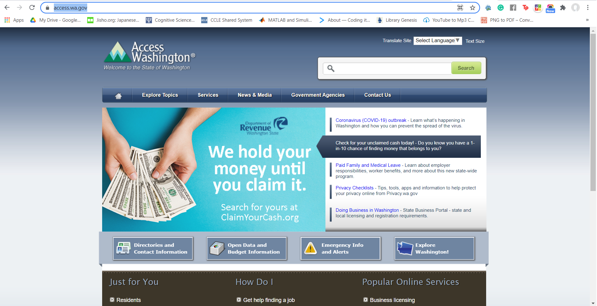

# (Title of your project)
## Kelly Truong, DH 110 Fall 2021 

### assignment01 : heuristic evaluation of Washington 

---

purpose of this assignment - 3-5 sentences what yu want to show via this assignment. 

https://access.wa.gov/

 

| Heuristic and descripion  | evaluation |  improvements |
|---------------------------|:----------:|--------------:|
| <b>Visibility of system status :</b>   App provides timely feedback and informing users of what is happening|  left-aligned | $1600 |
| <b>Match between real world and system : </b> App's design should   communicate in ways familiar to users, using familiar language  or layouts from the real world    |  centered   |   $12 |
| <b>User control and freedom</b> | right-aligned |    $1 |
| <b>Consistency and standards</b>  | right-aligned |    $1 |
| <b>Recognition rather than recall</b> | right-aligned |    $1 |
| <b>Error prevention</b> | right-aligned |    $1 |
| <b>Flexibility and efficiency of use</b>  | right-aligned |    $1 |
| <b>Aesthetics and minimal design</b>  | right-aligned |    $1 |
| <b>Help users with errors</b> | right-aligned |    $1 |
| <b>Help and documentation</b>  | right-aligned |    $1 |
